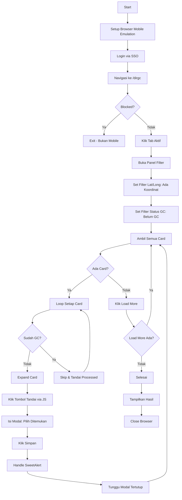

# MatchaPro GC Automation (Mobile Spoofer)

[](https://www.python.org/)
[](https://playwright.dev/)
[](https://github.com/albertassidiq/matchapro-gc-automation-playwright)

> **Alat Verifikasi Ground Check Otomatis** yang dirancang untuk mengemulasi perangkat HP, melewati batasan akses desktop pada platform MatchaPro.

---

## Ringkasan

**MatchaPro GC Automation** adalah skrip khusus yang dibangun menggunakan **Playwright** untuk mengotomatisasi proses "Tandai Usaha" pada platform BPS MatchaPro.

Platform ini membatasi beberapa fitur hanya untuk perangkat mobile ("Mobile Only"). Alat ini melewati batasan tersebut dengan cara:
1.  **Manipulasi User-Agent**: Merotasi profil perangkat Android kelas atas (Pixel 8, Samsung S24, OnePlus 15, dll).
2.  **Emulasi Layar Sentuh**: Menyuntikkan JavaScript untuk meniru titik sentuh dan properti navigator khusus mobile.
3.  **Manipulasi Header**: Mengirim header `X-Requested-With` dan Client Hints khusus agar terdeteksi sebagai aplikasi Android native.

## Fitur Utama

*   **Emulasi Mobile Native**: Menampilkan tampilan mobile (`/dirgc`) dengan benar di lingkungan desktop.
*   **Integrasi SSO**: Menangani login aman secara otomatis dengan kredensial yang diberikan via argumen.
*   **Smart Filter System**: Otomatis menerapkan filter:
    *   Tab "Aktif"
    *   Filter Lat/Long: "Ada Koordinat"  
    *   Filter Status GC: "Belum GC"
*   **Smart Infinite Scroll**: Mendeteksi kapan harus memuat lebih banyak data dengan tombol "Load More".
*   **Targeting Presisi**:
    *   Menargetkan kontainer kartu spesifik (`#usaha-cards-container`).
    *   Mengidentifikasi usaha yang belum diverifikasi berdasarkan `.gc-badge`.
    *   Tracking ID yang sudah diproses untuk menghindari duplikasi.
*   **Mode Senyap**: Menonaktifkan ciri-ciri otomasi browser untuk mengurangi risiko deteksi.

---

## Algoritma `tandai_ui_mobile.py`



### Langkah-langkah Detail:

1. **Setup Browser**: Inisialisasi Chromium dengan User-Agent Android acak dan viewport mobile (412x915).
2. **Login SSO**: Autentikasi ke `sso.bps.go.id` dengan kredensial yang diberikan.
3. **Navigasi**: Akses endpoint `/dirgc` yang biasanya terbatas untuk mobile.
4. **Apply Filters**: 
   - Klik tab "Aktif"
   - Set filter Lat/Long ke "Ada Koordinat"
   - Set filter Status GC ke "Belum GC"
5. **Proses Card**:
   - Scan semua `.usaha-card` yang terlihat
   - Skip card yang memiliki `.gc-badge`
   - Expand card dengan klik header
   - Klik tombol "Tandai" menggunakan JavaScript untuk presisi
   - Pilih "1. Ditemukan" di dropdown modal
   - Klik simpan dan handle success alert
6. **Load More**: Jika semua card sudah diproses, klik "Muat Lebih Banyak"
7. **Loop**: Ulangi sampai tidak ada lagi data

---

## Instalasi

### Prasyarat

*   Python 3.8+
*   [Playwright](https://playwright.dev/python/)

### Pengaturan

1.  **Clone repositori**
    ```bash
    git clone https://github.com/albertassidiq/matchapro-gc-automation-playwright.git
    cd matchapro-gc-automation-playwright
    ```

2.  **Instal dependensi**
    ```bash
    pip install playwright
    playwright install chromium
    ```

---

## Cara Penggunaan

Jalankan skrip melalui terminal. **Username dan password wajib diberikan**.

```bash
python tandai_ui_mobile.py <username> <password> [opsi]
```

### Argumen

| Argumen | Deskripsi | Wajib |
| :--- | :--- | :---: |
| `username` | Username SSO BPS Anda | ✅ Ya |
| `password` | Password SSO BPS Anda | ✅ Ya |
| `--otp` | Kode OTP (jika 2FA aktif) | Tidak |
| `--max` | Batas jumlah item yang diproses (Default: Tak Terbatas) | Tidak |

### Contoh

```bash
# Jalankan dengan kredensial
python tandai_ui_mobile.py user.name "Password123"

# Jalankan dengan OTP
python tandai_ui_mobile.py user.name "Password123" --otp 123456

# Jalankan dengan batas maksimal item
python tandai_ui_mobile.py user.name "Password123" --max 50
```

---

## Disclaimer

Alat ini dibuat untuk **tujuan edukasi dan efisiensi operasional internal saja**. Pastikan Anda memiliki otorisasi yang diperlukan untuk melakukan tindakan otomatis pada platform target. Gunakan dengan bijak.

---

<p align="center">
  Built with ❤️ by Albert Assidiq
</p>
